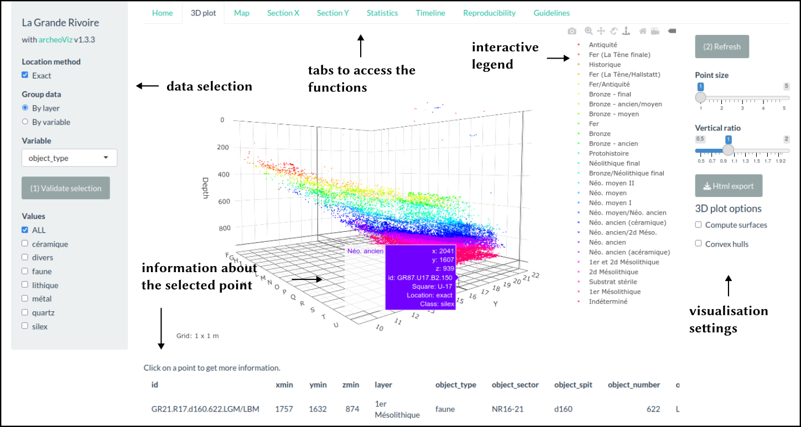

[comment]: https://pad.chapril.org/p/CidYRj_7vH_rUz43b1or

# Summary

`archeoViz` is an R Shiny application for the visualisation, interactive exploration, and web communication of archaeological spatial data  [@Plutniak2023archeoviz1.1.1], [@Plutniak2023bspf]. It generates interactive 3D plots, 2D cross sections and 2D maps of archaeological objects and their refitting relationships, computes basic spatial analysis methods (convex hull, regression surfaces, 2D kernel density estimation), and displays excavation timelines. This application is designed as the building block of a decentralised web edition network for archaeological data: 1) users can deploy `archeoViz` instances specific to their datasets on the server of their choice; 2) the *archeoViz portal*, a companion online application, references and documents with metadata these `archeoViz` instances, increasing their discoverability and audience on the web, both for scientists and the general audience interested in archaeology. It can also be used as an educational resource to introduce learners to spatial analysis, data formats, reproducible workflow, open science, and computational archaeology.

# Statement of Need

For more than a century, archaeologists have generated coordinated data during fieldwork. However, the results of these efforts are generally kept in inaccessible notebooks and hard drives, or –in the best cases– analysed and summarised as figures in publications, without providing the original data. Recent literature stressed that the lack of

1. accessible and handy tools,
2. training in data management,
3. time to prepare data for publication, and
4. recognition related to data publishing 

are factors explaining the insufficient availability of field archaeological data [@SelhoferGeser2015], [@Bernard2019].
Given the reluctance of archaeologists to publish data, `archeoViz` indirectly fosters data publication by demonstrating reuse, from the case of spatial archaeological data at the site level [@Plutniak2023archeoviz1.1.1], [@Plutniak2023bspf].

Its minimal and multilingual interface (viz. issue 1) and the simple data structure it requires (viz. issues 2, 3) make it handy to use and fast to deploy on the web. This contributes to promoting datasets as citable scientific outputs and so their creators (viz. issue 4).

# State of the Field

## Archaeological Visualisation Software

First, `archeoViz` is related to other archaeological visualisation software, relying on similar technologies. However, this software differs with regard to their specialisations and whether or not they are distributed as packages:

* Dataset-specific scripts or web applications:
	* Shannon McPherron's R Shiny [`Plot it`](https://www.oldstoneage.com) application (unpublished), 
	* Anthony Sécher's [`PyCoCu`](https://github.com/magdantho/pycocu) python script,
* R Shiny application implementing specific statistical methods, e.g. [@CouilletEtal2022],
* R packages:
	* `recexcavAAR`  [@SchmidSerbe2017] (no longer maintained)
	* `SEAHORS`  [@RoyerEtal2023], which offers more advanced visualisation features than `archeoViz` while being limited to this aspect.

## Geographic Information Systems

Second, `archeoViz` is a lightweight, complementary alternative to the more demanding and complex association of GIS software and export libraries, e.g. `ArchField` [@SmithEtal2015] or `QGIS` and its [`Qgis2threejs`](https://plugins.qgis.org/plugins/Qgis2threejs/) plugin to export in HTML format.

## Online Data Repositories

Third, regarding data publication and edition, `archeoViz` relates to centralised web repositories that include visualisation features, e.g. [`arkeoGIS`](https://arkeogis.org)  [@Bernard2019] and [`Field`](https://field.dainst.org/project). It differs in taking into account the third spatial dimension and in being a stand-alone application.
It is designed as the building block of a decentralised web edition network for archaeological data, made of as many `archeoViz`  instances as there are datasets.

# The Building Block of a Decentralised Web Edition Network for Archaeological Data

Since the 1960s, numerous attempts at building up standards and repositories were made in archaeology. All projects tended to collect as much data as possible and several independent databases existed with the same themes. The pitfalls of this centralised approach were addressed in the early 2000s with the development of the semantic web, ontologies, and linked open data technologies.

`archeoViz` is designed along this the same line. Rather than collecting all data in the same place as in the centralised approach, `archeoViz` users create a particular instance of `archeoViz` for each dataset to visualise and communicate. These instances can be deployed on the server of their choice ((e.g., [shinyapps.io](https://www.shinyapps.io), [huma-num](https://huma-num.fr), or any other institutional or personal server). Nevertheless, `archeoViz` can be used in four ways, from purely local (on the user’s machine), to purely remote, including or not data publication on third-party repositories \autoref{fig:workflow}.

# Key Features
  
## Interface and Functionalities

The `archeoViz` interface has two parts (\autoref{fig:interface}):

* a left-side menu  with options for data sub-selections
* a right-side panel with tabs to display the results of the functionalities.

These functionalities include:

* Interactive visualisations and exports (SVG and HTML) of:
	* 3D plot
	* 2D map plot
	* 2D section plot on the X axis
	* 2D section plot on the Y axis
* Reproducibility features, i.e. automatic generation of the command line to reproduce the current setting of the application
* Timeline of the findings discovery
* Guidelines for the application

## Data Input

Input data must be CSV files, loaded either through the application interface or in the command line, using the launching function's parameters.
The data structure is kept as simple as possible, with (few) mandatory and some optional variables \autoref{tab:input}.
 

\scriptsize

| **id** | square_x | square_y | **xmin** | xmax | **ymin** | ymax | **zmin** | zmax | **layer** | **object_type** | object_misc | 
|----|----------|----------| ---- | ---- | ---- | ---- | ---- | ---- | ----- | ----------- | -------------- | 
| 1  | A        | 1        |  50  |  54  |  66  |  70  |  20  |      |   1   |  lithic     |   biface       | 
| 2  | B        | 2        | 130  |      | 144  |      |  30  |  35  |   2a  |  fauna      |   deer antler  | 

: \normalsize Example of an input CSV file. Mandatory variables are in bold type. 'max' coordinates are for objects inaccurately located within a range.  An unlimited number of variables named using the “object_” prefix can be added. \label{tab:input}

\normalsize

# Research Using `archeoViz`

So far, 37 datasets have been edited on the web using `archeoViz` instances. They include about 303,000 objects and 10,000 refitting relationships (between fragments of broken objects).
To increase their discoverability and audience, the [*archeoViz portal*](https://analytics.huma-num.fr/archeoviz/home) gathers their references and metadata, and makes it possible to browse the list of instances with keywords and through a map.
 
Interoperability between software tools is key to their diffusion and adoption. Currently a work in progress, one of the first achievements came with the `SEAHORS` package [@RoyerEtal2023] which can generate CSV files in the `archeoViz` format.

# Resources and Examples

`archeoViz` is available on [CRAN](https://cran.r-project.org/package=archeoViz) and the code of the development version is available on [Github](https://github.com/sebastien-plutniak/archeoviz/). 
Documentation is made available embedded in the application (`Guidelines` tab) and as [Vignette](https://cran.r-project.org/web/packages/archeoviz/vignettes/archeoviz-vignette.html).
Users can receive news and find support by subscribing to the [archeoViz mailing list](https://listes.services.cnrs.fr/wws/info/archeoviz-users). 
Multiple use cases can be browsed through the [`archeoViz portal`](https://analytics.huma-num.fr/archeoviz/home), that are also referenced in the [HAL.science](https://hal.science/ARCHEOVIZ) repository.

# Acknowledgements

`archeoViz` is an R Shiny [@ChangEtal2020] application embedded in an R package [@Rcoreteam2023]. 
It relies on the `plotly` [@Sievert2020], `ggplot2` [@Wickham2016], and `htmlwidgets` [@VaidyanathanEtal2023] packages for the graphical outputs,
and spatial statistics use functions from the `cxhull` [@Laurent2023] and `mgcv` [@Wood2017] packages.

I thank 
Anaïs Vignoles (co-maintainer of the archeoViz portal),
Renata Araujo (Portuguese translation), Sara Giardino (Italian translation)
and the early users for their feedback and support: Astolfo Araujo, Jean-Pierre Chadelle, Elsa Defranoult, Solène Denis, Emmanuel Discamps, Mathieu Langlais, Maureen Le Doaré, Grégor Marchand, Jean-Claude Marquet, Alexandre Michel, Thomas Perrin, Anthony Sécher, Peter Tóth.
Finally, I acknowledge the [tDAR](https://core.tdar.org) team at the [Center for Digital Archaeology](https://live-digant.ws.asu.edu), where this paper was written and the [SEADDA](https://www.seadda.eu) European COST action that funded this research stay.

# References
